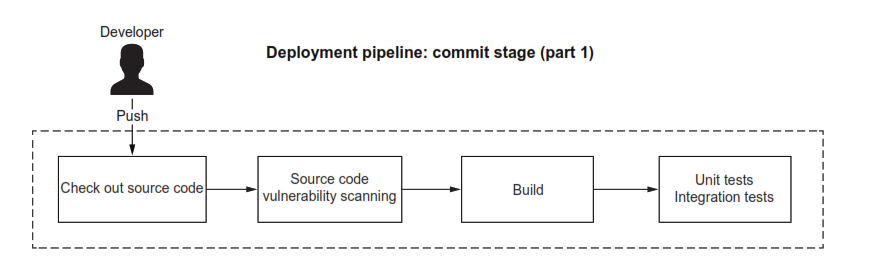
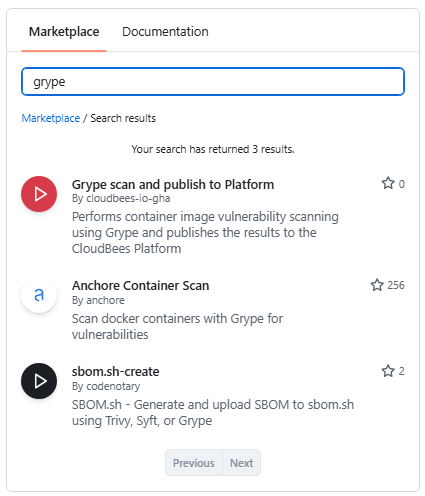

# ATU Cloud Native Computing

# Lab: Build and Test Pipeline

## Lab Objectives

In this lab you'll:

- Understand the purpose and structure of a commit stage in a deployment pipeline
- Configure a GitHub Actions workflow to automate build and test processes
- Implement dependency vulnerability scanning with Dependabot
- Verify code quality through automated testing
- Configure appropriate permissions for security events

## Introduction

In cloud-native development, a deployment pipeline automates the journey of code from commit to production. The **commit stage** is the first and most critical phase of this pipeline. It provides rapid feedback to developers by automatically building, testing, and validating code changes immediately after they're committed.

The commit stage acts as a quality gate that prevents broken code from progressing further in the pipeline. By running this stage on every commit and pull request, teams can identify integration issues early when they're cheapest to fix, maintain a clean main branch, and deploy with confidence.

In this lab, you'll implement a commit stage for a Java Spring Boot application using GitHub Actions. This workflow will automatically compile the application, run unit tests, and scan for dependency vulnerabilities whenever code is pushed or a pull request is opened.

# Pipeline and Commit Stage Summary

## What is a Pipeline

- A pipeline is an automated process that takes source code through various stages from development to production
- It consists of a series of sequential stages, each performing specific validation and preparation tasks
- Ensures code quality, functionality, and readiness for deployment through systematic checks
- Automates the software delivery process to reduce manual effort and human error

## The Commit Stage (First Stage of Pipeline)



### Stage Purpose
- The commit stage is the initial phase triggered after a developer commits new code to the mainline codebase

### Key Activities Performed
- Build process execution to compile the code
- Unit tests to verify individual components work correctly
- Integration tests to check how components interact with each other
- Static code analysis for code quality, security vulnerabilities, and potential issues
- Packaging of the application into deployable format

### Output and Artifacts
- Produces an executable application artifact at the end of the stage
- This artifact serves as a release candidate for potential deployment to subsequent pipeline stages
- Examples include JAR files published to Maven repositories or container images published to container registries

### Continuous Integration Support
- Directly supports and enables the continuous integration (CI) practice
- Ensures code changes are regularly integrated and validated against the existing codebase

### Performance Requirements
- Designed to be fast, ideally completing in under five minutes
- Speed is critical to provide developers with rapid feedback on their code changes
- Quick turnaround allows developers to efficiently move on to their next task without long waiting periods

### Developer Experience
- Fast feedback loop helps maintain productivity, catch issues early in the development cycle, and prevent broken code from progressing further in the pipeline

# Running Pipeline Steps Locally
Before automating the build and test process in GitHub Actions, it's important to understand how to run the pipeline steps locally. This gives you immediate feedback during development and helps you verify that your pipeline configuration will work correctly.

## Run Tests with Gradle
Gradle is a build automation tool that manages dependencies, compiles code, and runs tests. The Spring Boot project includes a Gradle wrapper (`gradlew`) that ensures you're using the correct Gradle version.

### Option 1: Using the Terminal (Command Line)

Run all tests with the following command:

```bash
./gradlew test
```

This command will:
- Compile your source code
- Compile your test code
- Execute all unit tests in the project
- Generate test reports

### Option 2: Using IntelliJ IDEA

IntelliJ provides several ways to run tests:

1. **Using the Gradle tool window:**
    - Open the Gradle tool window (View → Tool Windows → Gradle)
    - Navigate to: `project-name → Tasks → verification → test`
    - Double-click `test` to run all tests

2. **Run from the Project view:**
    - Right-click on the `src/test/java` folder
    - Select "Run 'All Tests'"

3. **Run a specific test class or method:**
    - Click the green play icon in the gutter next to the class or method name

### Understanding Test Output

#### Terminal Output

When tests complete in the terminal, you'll see a summary:

```
BUILD SUCCESSFUL in 3s
4 actionable tasks: 4 executed
```

However, this high-level summary doesn't show detailed information about individual tests.

#### IntelliJ Test Runner

When you run tests through IntelliJ, the Test Runner panel appears at the bottom showing:
- A tree view of test classes and methods with pass/fail icons
- Real-time execution progress and statistics
- For failed tests: click on them to see assertion failures and stack traces with clickable navigation to the source code

#### Viewing Detailed Gradle HTML Test Reports

Gradle generates comprehensive HTML reports that provide more detailed information than the terminal or IntelliJ summary views.

After running tests via Gradle, the report is generated at:

```
build/reports/tests/test/index.html
```

**To view this report in IntelliJ:**

1. In the Project view, navigate to `build/reports/tests/test/`
2. Right-click on `index.html`
3. Select "Open In → Browser"

**What the HTML report shows:**

- **Summary page**: Overview statistics including total tests, pass/fail counts, and execution time
- **Packages tab**: Test results organized by package
- **Classes tab**: Test results organized by class
- **Individual test details**: Click on any test class to see:
    - All test methods in that class with execution times
    - Standard output and error messages
    - Full stack traces for failures

**Analyzing failures in the HTML report:**

When a test fails, the report displays:

```
org.opentest4j.AssertionFailedError: expected: <200> but was: <500>
    at com.example.BookControllerTests.shouldReturnBookWhenExists(BookControllerTests.java:45)
```

This shows:
- The type of assertion failure
- Expected vs actual values
- The exact line where the test failed
- The complete stack trace

**Example: Navigating the HTML report**

1. Open `index.html` - see the summary dashboard
2. Click on "Classes" tab - browse tests by class
3. Click on a specific test class (e.g., `BookControllerTests`)
4. View all test methods, their status, and execution times
5. For failures, see the complete error message and stack trace

The HTML report is particularly valuable for:
- Getting a comprehensive view of all test results in one place
- Seeing test execution times to identify slow tests
- Sharing test results with team members
- Reviewing historical test runs

### Understanding Test Success Criteria

Tests pass when:
- All assertions are true
- No exceptions are thrown (unless expected)
- The test completes within any specified timeout

Tests fail when:
- An assertion fails (actual value doesn't match expected)
- An unexpected exception occurs
- The test exceeds a timeout threshold

### Running Specific Tests

**From the terminal:**
```bash
# Run tests for a specific class
./gradlew test --tests BookControllerTests

# Run tests matching a pattern
./gradlew test --tests *ControllerTests
```

**In IntelliJ:**
- Right-click on any test class, method, or package and select "Run"

### Verifying Your Setup

Before proceeding to automate the pipeline, verify your local test execution:

1. Run `./gradlew test` from the terminal or use IntelliJ's Gradle task
2. Confirm you see `BUILD SUCCESSFUL` in the terminal
3. Open the HTML report at `build/reports/tests/test/index.html`
4. Verify all tests passed (check the summary statistics)
5. Explore the report structure: navigate through packages and classes
6. Examine a few test cases to understand what they're testing

Once tests pass locally, you're ready to configure the automated commit stage pipeline that will run these same tests on every push and pull request.

## Vulnerability Scanning with Grype

Security is a critical aspect of cloud-native applications. Vulnerabilities in dependencies can expose your application to attacks, data breaches, and compliance issues. In a deployment pipeline, it's essential to scan for known vulnerabilities early and often, ideally as part of the commit stage before code progresses further.

**Grype** is a vulnerability scanner for container images and filesystems. It matches packages and their versions against known vulnerability databases (CVEs) from sources like the National Vulnerability Database (NVD). By integrating Grype into your local development workflow and CI/CD pipeline, you can identify and remediate security issues before they reach production.

### Installing Grype

Grype is a command-line tool that can scan various sources including directories, container images, and archives.

**Installation on Linux/Mac:**

```sh
curl -sSfL https://raw.githubusercontent.com/anchore/grype/main/install.sh | sudo sh -s -- -b /usr/local/bin
```

**Verify the installation:**

```bash
grype version
```

You should see output showing the Grype version, for example:
```
Application:          grype
Version:              0.74.0
```

**For other installation methods** (Windows, Homebrew, Docker), see the [Grype GitHub repository](https://github.com/anchore/grype).

### Scanning Your Project

Grype can scan your project directory to identify vulnerabilities in dependencies.

**Scan the current directory:**

```bash
grype .
```

**What happens during a scan:**

1. **Vulnerability DB update**: Grype downloads the latest vulnerability database (this happens automatically on the first run and periodically thereafter)
2. **Filesystem cataloging**: Grype indexes the files in your project
3. **Package detection**: Identifies dependencies from build files (e.g., `build.gradle`, `pom.xml`, `package.json`)
4. **Vulnerability matching**: Compares detected packages against the vulnerability database
5. **Report generation**: Displays findings organized by severity

### Understanding Scan Results

**Example output with no vulnerabilities:**

```
comp09034@lab9PXXRG:~/lab-pipeline-commit$ grype .
 ✔ Vulnerability DB                [updated]
 ✔ Indexed file system                                                                                              .
 ✔ Cataloged contents                                cdb4ee2aea69cc6a83331bbe96dc2caa9a299d21329efb0336fc02a82e1839a8
   ├── ✔ Packages                        [0 packages]
   └── ✔ Executables                     [0 executables]
 ✔ Scanned for vulnerabilities     [0 vulnerability matches]
   ├── by severity: 0 critical, 0 high, 0 medium, 0 low, 0 negligible
   └── by status:   0 fixed, 0 not-fixed, 0 ignored [0000]  WARN no explicit name and version provided for directory source, deriving artifact
```

### Vulnerability Severity Levels

Understanding severity helps prioritize remediation efforts:

- **Critical**: Severe vulnerabilities that should be addressed immediately. Often allow remote code execution or complete system compromise.
- **High**: Serious vulnerabilities that could significantly impact security. Should be addressed quickly.
- **Medium**: Moderate vulnerabilities that pose some risk. Should be addressed in normal development cycle.
- **Low**: Minor vulnerabilities with limited impact. Address as time permits.
- **Negligible**: Very low risk vulnerabilities, often theoretical or requiring unusual conditions.

```
comp09034@lab9PXXRG:~/lab-pipeline-commit$ grype .
 ✔ Vulnerability DB                [updated]
 ✔ Indexed file system                                                                                              .
 ✔ Cataloged contents                                cdb4ee2aea69cc6a83331bbe96dc2caa9a299d21329efb0336fc02a82e1839a8
   ├── ✔ Packages                        [0 packages]
   └── ✔ Executables                     [0 executables]
 ✔ Scanned for vulnerabilities     [0 vulnerability matches]
   ├── by severity: 0 critical, 0 high, 0 medium, 0 low, 0 negligible
   └── by status:   0 fixed, 0 not-fixed, 0 ignored [0000]  WARN no explicit name and version provided for directory source, deriving artifact
```

### Scanning Built Artifacts

For more comprehensive scanning, build your project first so Grype can analyze compiled artifacts and extracted dependencies:

```bash
# Build the project
./gradlew build

# Scan the build output
grype build/libs
```


# Automating the Commit Stage with a Pipeline

Now that you understand how to run tests and vulnerability scans locally, it's time to automate these processes in a deployment pipeline. GitHub Actions provides a powerful platform for implementing continuous integration workflows that execute automatically whenever code changes are pushed to the repository.

### Understanding GitHub Actions Workflows

A GitHub Actions **workflow** is an automated process defined in YAML that responds to events in your repository. Workflows enable you to implement the commit stage of your deployment pipeline, providing rapid feedback to developers about code quality and security.

**Key workflow concepts:**

- **Event triggers**: Workflows are triggered by repository events such as:
    - `push` - code is pushed to a branch
    - `pull_request` - a pull request is opened or updated
    - `schedule` - time-based triggers (e.g., nightly builds)
    - `workflow_dispatch` - manual trigger

- **Jobs**: A workflow contains one or more jobs that run in parallel by default. Each job:
    - Executes on a fresh runner instance (virtual machine)
    - Can depend on other jobs to create sequential execution
    - Has its own set of steps that run sequentially

- **Runner**: A server that executes jobs. GitHub provides hosted runners with:
    - Ubuntu Linux (most common for Java applications)
    - Windows
    - macOS

- **Steps**: The individual tasks within a job, executed sequentially. Steps can be:
    - **Actions**: Pre-built, reusable components for common tasks (e.g., checking out code, setting up Java, uploading artifacts)
    - **Shell commands**: Direct execution of scripts or commands (e.g., `./gradlew build`)

- **Permissions**: Workflows need explicit permissions to interact with GitHub resources:
    - `contents: read` - Required to check out repository code
    - `security-events: write` - Required to publish vulnerability scan results to GitHub Security

### Workflow Structure for the Commit Stage

For our commit stage pipeline, we'll create a workflow that:

1. **Checks out the source code** from the repository
2. **Sets up the Java environment** with the correct JDK version
3. **Runs vulnerability scanning** with Grype
4. **Builds the application** using Gradle
5. **Executes tests** to verify functionality

This workflow will run on every push to the main branch and on every pull request, ensuring code quality before changes are merged.

### Creating the Workflow File

GitHub Actions workflows are stored in the `.github/workflows/` directory of your repository as YAML files.

**Steps to create your commit stage workflow:**

1. **Navigate to the Actions tab** in your GitHub repository
2. **Browse workflow templates**: GitHub suggests workflows based on your repository content
3. **Select "Java with Gradle"**: This provides a starter template for Java projects using Gradle
4. **Click "Configure"**: Opens the workflow editor

You'll see a template similar to this:

```yaml
name: Java CI with Gradle

on:
  push:
    branches: [ "main" ]
  pull_request:
    branches: [ "main" ]

permissions:
  contents: read

jobs:
  build:
    runs-on: ubuntu-latest
    steps:
    - uses: actions/checkout@v4
    - name: Set up JDK 17
      uses: actions/setup-java@v4
      with:
        java-version: '17'
        distribution: 'temurin'
    - name: Build with Gradle
      run: ./gradlew build
```

### Customizing the Workflow

Modify the template to create your commit stage workflow:

**1. Rename the file**: Change the filename from `gradle.yml` to `commit-stage.yml`

**2. Update the workflow name**:
```yaml
name: Commit Stage
```

**3. Add security-events permission**:
```yaml
permissions:
  contents: read
  security-events: write
```

The `security-events: write` permission allows the workflow to publish vulnerability scan results to GitHub's Security tab.

**4. Rename the job**:
```yaml
jobs:
  build-and-test:
    runs-on: ubuntu-latest
```

Using a descriptive job name like `build-and-test` makes workflow runs easier to understand.

**5. Save and commit**:
- Review your changes in the editor
- Add a commit message like "Add commit stage workflow"
- Click "Commit changes"

### Complete Commit Stage Workflow

Here's what your complete `commit-stage.yml` file should look like:

```yaml
name: Commit Stage

on:
  push:
    branches: [ "main" ]
  pull_request:
    branches: [ "main" ]

permissions:
  contents: read
  security-events: write

jobs:
  build-and-test:
    runs-on: ubuntu-latest
    steps:
    - name: Checkout source code
      uses: actions/checkout@v4
      
    - name: Set up JDK 17
      uses: actions/setup-java@v4
      with:
        java-version: '17'
        distribution: 'temurin'
        
    - name: Setup Gradle
      uses: gradle/actions/setup-gradle@v3
      
    - name: Build with Gradle
      run: ./gradlew build
      
    - name: Run tests
      run: ./gradlew test
```

### Understanding the Workflow Steps

Let's examine each step in detail:

**Step 1: Checkout source code**
```yaml
- name: Checkout source code
  uses: actions/checkout@v4
```
- Uses the official `checkout` action to clone your repository onto the runner
- This makes your code available to subsequent steps
- `@v4` specifies version 4 of the action

**Step 2: Set up JDK**
```yaml
- name: Set up JDK 17
  uses: actions/setup-java@v4
  with:
    java-version: '17'
    distribution: 'temurin'
```
- Installs Java Development Kit 17
- `temurin` is the Eclipse Temurin distribution (formerly AdoptOpenJDK)
- Ensures the runner has the correct Java environment for your application

**Step 3: Setup Gradle**
```yaml
- name: Setup Gradle
  uses: gradle/actions/setup-gradle@v3
```
- Configures Gradle with caching to speed up builds
- Caches dependencies and build outputs between workflow runs
- Significantly improves build performance

**Step 4: Build with Gradle**
```yaml
- name: Build with Gradle
  run: ./gradlew build
```
- Compiles the application
- Downloads dependencies
- Packages the application
- This is a shell command step, not an action

**Step 5: Run tests**
```yaml
- name: Run tests
  run: ./gradlew test
```
- Executes all unit tests
- Note: `./gradlew build` already runs tests, but having a separate step makes test results more visible in the workflow log

### Workflow Execution

When you commit the workflow file:

1. **GitHub triggers the workflow** because the commit is a `push` event to `main`
2. **A runner is provisioned** (Ubuntu virtual machine)
3. **Each step executes sequentially**:
    - If any step fails, subsequent steps are skipped
    - The job is marked as failed
4. **Results are displayed** in the Actions tab

### Viewing Workflow Runs

To see your workflow in action:

1. Navigate to the **Actions** tab in your repository
2. Click on the **Commit Stage** workflow
3. Select a specific workflow run to see:
    - Overall status (success/failure)
    - Job duration
    - Each step's output and execution time
4. Click on any step to see its detailed logs

**What to look for in successful runs:**
- All steps show green checkmarks
- Build completes without errors
- All tests pass
- Total execution time (aim for under 5 minutes)

**Common failure scenarios:**
- **Compilation errors**: Code doesn't compile
- **Test failures**: One or more tests fail
- **Dependency issues**: Cannot download required dependencies
- **Permission errors**: Missing required permissions

### Why Separate Build and Test Steps?

You might notice that `./gradlew build` already runs tests. Having a separate `./gradlew test` step provides:

- **Clearer logs**: Test output is isolated in its own step
- **Better visibility**: Can quickly identify if failure was in build or tests
- **Future flexibility**: Easy to add test-specific configurations (e.g., code coverage, test reports)

### Next Steps

Your commit stage workflow now automatically builds and tests your application on every commit. In the following sections, you'll enhance this workflow by:

- Adding vulnerability scanning with Grype
- Configuring Dependabot for automated dependency updates
- Publishing test results and security findings

## Adding Vulnerability Scanning to the Workflow

Now that you have a basic commit stage workflow that builds and tests your application, you'll enhance it by adding automated vulnerability scanning with Grype. This ensures that every code change is automatically checked for security vulnerabilities before it can be merged.

### Installing the Grype Action

GitHub Actions has a marketplace with thousands of pre-built actions that you can use in your workflows. Anchore provides an official Grype action that makes it easy to scan for vulnerabilities in your CI/CD pipeline.

**Steps to add Grype scanning:**

1. **Navigate to your workflow file** in `.github/workflows/commit-stage.yml`
2. **Edit the file** by clicking the pencil icon
3. Search for grype in the Actions Marketplace
4. Select the **Anchore Security Scan** action
5. Customise the action config as follows:
   

```yaml
    - name: Anchore Container Scan
      uses: anchore/scan-action@v3.6.4
      id: scan
      with:
        # The path to scan. This option is mutually exclusive with "image" and "sbom".
        path: "${{ github.workspace }}"
        # Set to false to avoid failing based on severity-cutoff. Default is to fail when severity-cutoff is reached (or surpassed)
        fail-build: true
        severity-cutoff: high
        acs-report-enable: true
```

- `path` specifies the path to scan for vulnerabilities
- `fail-build` specifies whether to fail the workflow if vulnerabilities are found
- `severity-cutoff` specifies the minimum severity level to report
- `acs-report-enable` enables Anchore Container Security (ACS) reports

### Publish Vulnerability Reports
Now add a step to upload the vulnerability report to GitHub Security using Github's [CodeQL Action](https://github.com/github/codeql-action):
```yaml
    - name: Upload vulnerability report
      uses: github/codeql-action/upload-sarif@v3
      if: success() || failure()
      with:
        sarif_file: ${{ steps.scan.outputs.sarif }}
```

- `github/codeql-action/upload-sarif@v3` - GitHub's action for uploading security results
- `if: success() || failure()` - Runs this step whether the scan passes or fails (ensures results are always uploaded)
- `sarif_file: results.sarif` - The scan results file in SARIF format (Security Automation Results Interchange Format)

### Updated Workflow with Vulnerability Scanning

Here's your complete workflow with vulnerability scanning integrated:

<details>
<summary>Click to expand</summary>

```yaml
name: Commit Stage

on:
  push:
    branches: [ "main" ]
  pull_request:
    branches: [ "main" ]
  workflow_dispatch:

jobs:
  build:

    runs-on: ubuntu-latest
    permissions:
      actions: read
      contents: read
      security-events: write

    steps:
    - uses: actions/checkout@v4
    - name: Set up JDK 17
      uses: actions/setup-java@v4
      with:
        java-version: '17'
        distribution: 'temurin' 
        
    # Configure Gradle for optimal use in GitHub Actions, including caching of downloaded dependencies.
    # See: https://github.com/gradle/actions/blob/main/setup-gradle/README.md
    - name: Setup Gradle
      uses: gradle/actions/setup-gradle@af1da67850ed9a4cedd57bfd976089dd991e2582 # v4.0.0

    - name: Build with Gradle Wrapper
      run: ./gradlew build

    - name: Anchore Container Scan
      uses: anchore/scan-action@v3.6.4
      id: scan
      with:
        # The path to scan. This option is mutually exclusive with "image" and "sbom".
        path: "${{ github.workspace }}"
        fail-build: true
        severity-cutoff: high
        acs-report-enable: true

    - name: Upload vulnerability report
      uses: github/codeql-action/upload-sarif@v3
      if: success() || failure()
      with:
        sarif_file: ${{ steps.scan.outputs.sarif }}
```

</details>

### Trigger Vulnerability Alert
To see the pipeline in action detecting a vulnerabiliility, let's add a known vulnerability to `build.gradle`:
```json
implementation 'org.apache.logging.log4j:log4j-core:2.14.1' // Vulnerable dependency for teaching purposes	
```
Log4j is a popular Java logging framework that is broadly used in a variety of consumer and enterprise services, websites, and applications, as well as in operational technology products. This particular version of Log4j (2.14.1) is vulnerable to one of the most critical security vulnerabilities ever discovered in software history: Log4Shell (CVE-2021-44228).
The vulnerability was estimated to have the potential to affect hundreds of millions of devices worldwide, and exploitation was incredibly easy to perform.

Commit this change and examine the results of the pipeline in Github Actions and the Security tab of your repository.


